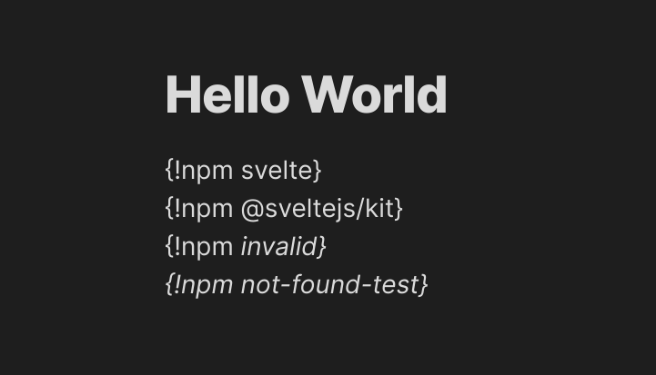
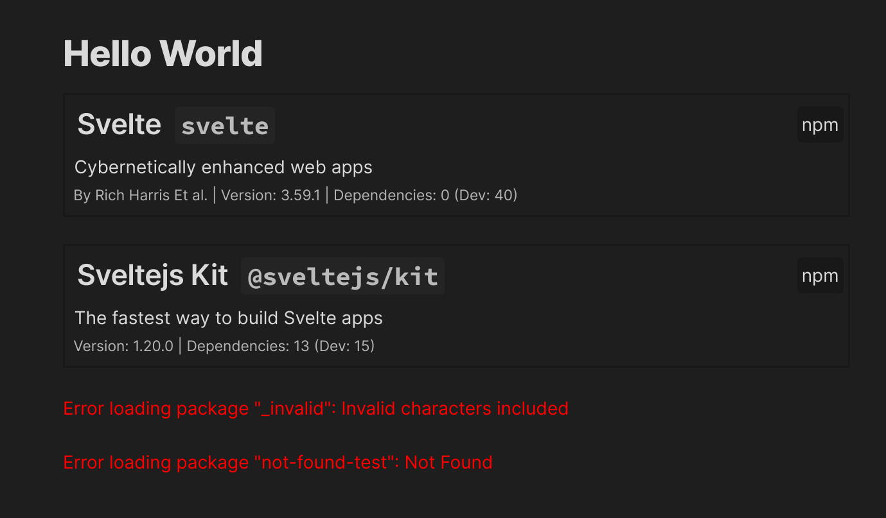

# obsidian-npm-preview

A simple way to show the information of a node package in Obsidian

## Example

### Input (Edit mode)

### Result (Preview Mode)

## Usage

Add `{!npm <package_name>}` anywhere in your file. It should show the element when you switch over to preview mode.

## Developing

-   Clone this repo.
-   `npm i` or `yarn` to install dependencies
-   `npm run dev` to start compilation in watch mode.

## Manually installing the plugin

-   Copy over `main.js`, `styles.css`, `manifest.json` to your vault `VaultFolder/.obsidian/plugins/your-plugin-id/`.
